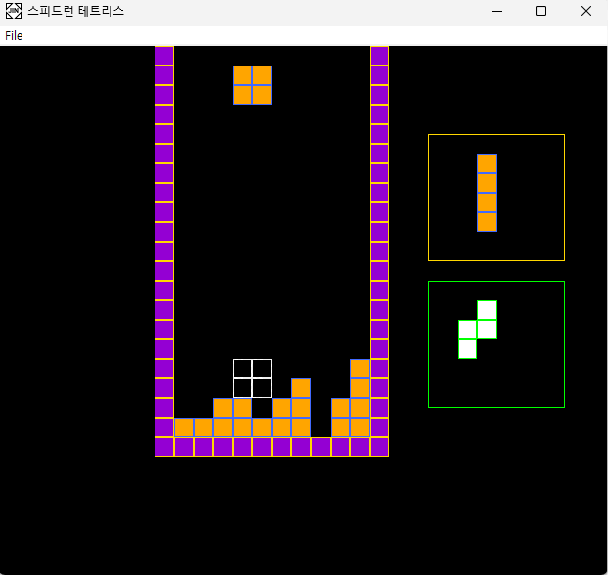

# Tetris 
Tetris_Framework, 개인 프로젝트(C + Windows API) 

수업 자료로 제공된 기본 테트리스 프레임워크에 **Ghost Block, Next Block, Hold** 기능을 추가 구현한 프로젝트 

## 스크린샷 

## 자체 구현 기능 

- ** Ghost Block :** 착지 예상 지점 표시 
- ** Next Block :** 다음 블록 미리보기 
- ** Hold :** 블록 저장 및 교환 (C 키) 

## 기술 스택 

- **언어 :** C 
- **API :** Windows API, GDI 
- **개발 도구 :** Visual Studio 

## 조작법 

키     | 동작 
← →    | 좌우 이동 
↑      | 회전 
↓      | 하강 
Space  | 즉시 낙하 
C      | 저장/교환 

## 프로젝트 구조 

- `MyTetris.cpp`: 메인 소스 코드 (1,605줄) 
- `screenshots/`: 게임 스크린샷 및 데모 영상 
- `docs/`: 개발 과정 문서 

## 개발 과정

자세한 개발 과정은 [개발 노트](tetris_mission__고민의_흔적.txt)를 참고 

**주요 개발 내용 :** 
- Ghost Block : 착지 예상 지점 실시간 표시 시스템 구현 
- Next Block : 다음 블록 미리보기 렌더링 영역 추가 
- Hold 기능: 블록 저장 및 교환 시스템 구현 (턴당 1회 제한) 

## 기술적 도전 과제 

- Ghost Block과 Hold 기능 간 상호작용 시 발생한 중복 표시 문제 해결 
- PreGhostY 변수를 통한 렌더링 최적화 
- Windows GDI 리소스 생명주기 관리 

## 구현 통계 

- **추가 코드 :** 485줄 (전체의 약 30%) 
- **추가 함수 :** 6개 (DrawGhostBlock, EraseGhostBlock, DrawNextBlock, Hold 등) 
- **추가 변수 :** 8개 
- **완성 기능 :** 3개 (Ghost Block, Next Block, Hold) 
- **진행 중**: 1개 (Obstacle)

## 향후 계획 

1. **장애물 블록 시스템 완성** 
   - 타이머 기반 랜덤 장애물 생성 
   - 난이도 증가 시스템 

2. **추가 기능** 
   - 점수 시스템 UI 
   - 레벨 시스템 
   - 효과음 및 배경음악 

3. **최적화** 
   - 렌더링 성능 개선 
   - 메모리 사용량 최적화 

## 실행 방법 

1. Visual Studio에서 프로젝트 열기 
2. Windows API 환경 확인 
3. F5로 빌드 및 실행 

## 라이선스 

이 프로젝트는 학습 목적으로 제작되었습니다. 
